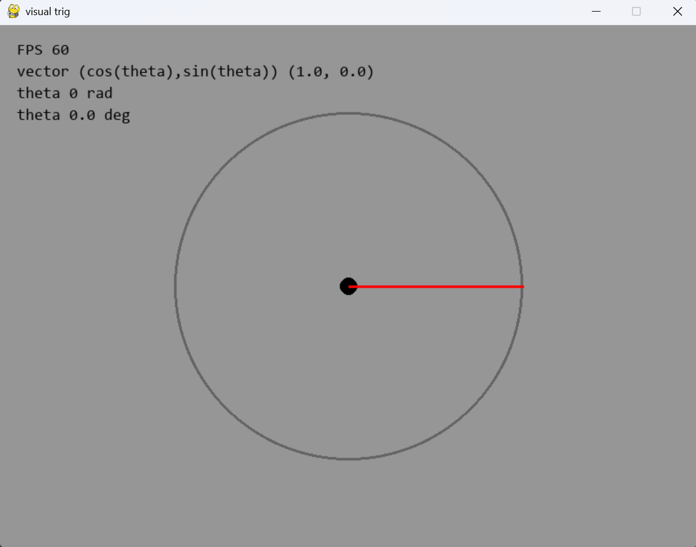

# Pygame Unit Circle

A simple interactive trigonometry visualizer made with Python and Pygame.

## Controls

* **W**: Move forward
* **S**: Move backward
* **A**: Rotate left
* **D**: Rotate right

## Preview
